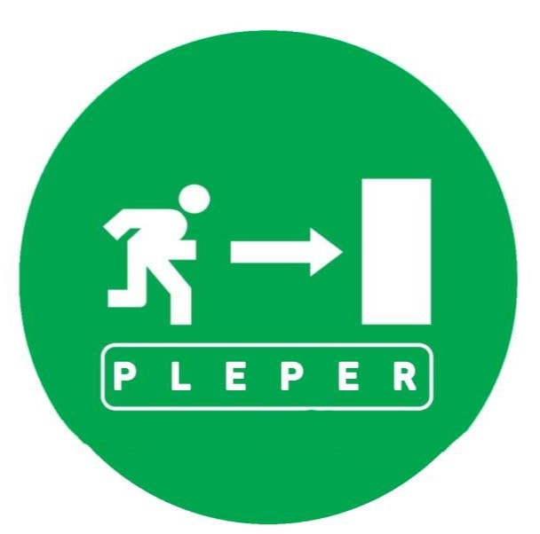

# Proyecto PLEPER
## Placa de Energía Piezoeléctrica Renovable 

| Página web | Email | Instagram |
|------------|-------|-----------|
|[Página Web](https://cat-bounce.com/)|pleper.infoimpa@gmail.com|[@pleper_25](https://www.instagram.com/pleper_25/?igsh=Y2xkMGg4Z2V1NHdl#)|

## ⚡ Energía en cada paso.

&nbsp;&nbsp;&nbsp;&nbsp;&nbsp;&nbsp;PLEPER es un sistema que busca aprovechar la energía mecánica generada por el paso de las personas sobre una baldosa piezoeléctrica para convertirla en energía eléctrica. Este sistema se destina a la alimentación de una luz de emergencia LED, enfocándose en su aplicación en los subtes de la Ciudad. Para optimizar su funcionamiento, el sistema cuenta con un microcontrolador que supervisa la energía generada y la muestra en una pantalla LCD, brindando información en tiempo real sobre su rendimiento.

&nbsp;&nbsp;&nbsp;&nbsp;&nbsp;&nbsp;Este proyecto busca demostrar la viabilidad de la energía piezoeléctrica, aunque el prototipo inicial se centra en aplicaciones pequeñas, la tecnología podría escalarse para aprovechar el tráfico peatonal y vehicular en entornos urbanos.

## 💡 ¿Qué aporta a la sociedad?
&nbsp;&nbsp;&nbsp;&nbsp;&nbsp;&nbsp;El mayor impacto que busca generar nuestro proyecto es el de incorporar, de manera inocua, métodos de generación de energía renovables al día a día de las personas, interactúando con la generación de energía y siend a su vez más conscientes de las problematicas ambientales que conllevan los métodos tradiconales de generación de energía.  

## 🔧 Características Principales

- **Generación de Energía Limpia**: Convierte la energía mecánica del movimiento en electricidad utilizable.
- **Aplicaciones Versátiles**: Puede integrarse en pisos de estaciones de tren, centros comerciales, aeropuertos y rutas de alta circulación.
- **Bajo Impacto Ambiental**: No requiere combustibles fósiles.
- **Escalabilidad**: Diseño adaptable para aumentar la eficiencia con múltiples módulos piezoeléctricos en serie o paralelo.

## 🏙️ Aplicaciones

- **Espacios públicos**: Calles y veredas con alto tráfico peatonal.
- **Transporte**: Integración en rutas para aprovechar la presión de los vehículos.
- **Edificios Inteligentes**: Estaciones de transporte y centros comerciales.
- **Eventos Masivos**: Estadios y conciertos donde miles de personas generan energía con sus movimientos.

## 🛠️ Tecnología Utilizada

- **Componentes Principales**:
  - Buzzer cerámico piezoeléctrico
  - Circuito rectificador
  - Almacenamiento en condensadores
  - Microcontrolador para medición de energía generada
  
- **Software**:
  - Diseño de placa en AutoCad
  - Simulaciones en software de circuitos

## Integrantes:

### Victoria Josefina Baza

- 📷 Instagram: [@lavicky_victoria](https://www.instagram.com/lavicky_victoria/)

- 📧 victoriajosefinabaza@gmail.com

- LinkedIn: [Victoria J Baza](http://www.linkedin.com/in/victoriajbaza/)

### Mauricio Blasco

- 📷 Instagram: [@maauricio.bl](https://www.instagram.com/maauricio.bl/)

- 📧 sirmauriciob@gmail.com

- LinkedIn: [Mauricio Blasco](https://www.linkedin.com/in/mauriciobl/)

### Víctor Raúl Broncano Ramos

- 📷 Instagram: [@raul_broncano](https://www.instagram.com/raul_broncano/)

- 📧 raul455896@gmail.com

- LinkedIn: [Victor Raúl Broncano Ramos](https://www.linkedin.com/in/raul-broncano-3734a0357/)

### Ignacio García Louzan

- 📷 Instagram: [@ignacio_1907](https://www.instagram.com/ignacio_1907/)

- 📧 nachogarcialouzan@gmail.com

- LinkedIn: [Ignacio García Louzan](https://www.linkedin.com/in/ignacio-garc%C3%ADa-louzan/)

### Isidro Joaquín Stabile

- 📧 isidrost@hotmail.com

- LinkedIn: [Isidro Joaquín Stabile](https://www.linkedin.com/in/isidro-stabile-4104a0357/)

### Santiago Alejandro Tejeda

- 📷 Instagram: [@santiago.teje](https://www.instagram.com/santiago.teje/)
  
- 📧 santiagotejeda36@gmail.com

- LinkedIn: [Santiago Alejandro Tejeda](https://www.linkedin.com/in/santiago-tejeda/)

## Contactanos

### Instagram: [@pleper_25](https://www.instagram.com/pleper_25/)

### Pagina web: [lopachon](https://www.lopa.ar)

### Mail: pleper.infoimpa@gmail.com
